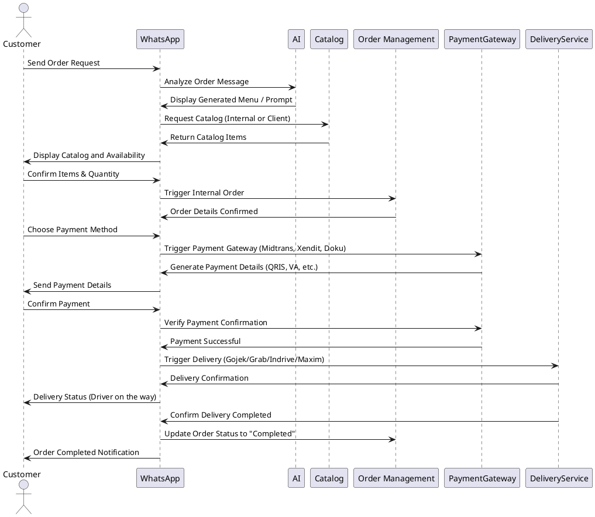

# Order Management System via WhatsApp

This system integrates WhatsApp as the main channel for customer orders and manages the entire order process, from product selection to payment and delivery, leveraging various external services (AI, catalogs, payment gateways, delivery services).

## Flow Overview

1. **Customer Initiates Order via WhatsApp:**
   - Customer sends a message via WhatsApp.
   - WhatsApp triggers the AI system to analyze the message (using NLP/AI) to identify order intent and display a generated menu or prompt.

2. **Display Integrated Catalog:**
   - AI determines whether to show the internal catalog or the client's (pharmacy, retail, etc.) integrated catalog.
   - Customer selects items and specifies quantities.

3. **Check Item Availability:**
   - WhatsApp confirms item availability (e.g., stock quantity) from the internal or client’s catalog.
   - Customer is informed whether the items are available for order.

4. **Order Confirmation & Payment Method Selection:**
   - Customer confirms order details (items and quantities).
   - Customer is prompted to choose a payment method (via WhatsApp interface).
   
5. **Payment Gateway Integration:**
   - Payment method selection triggers WhatsApp to call the appropriate payment gateway (Midtrans, Xendit, Doku).
   - WhatsApp generates payment information (QRIS, VA, etc.), and this is sent to the customer.
   
6. **Customer Makes Payment:**
   - Customer proceeds with payment via the selected method (QRIS, Virtual Account, etc.).
   - Customer shares payment confirmation with WhatsApp.

7. **Delivery Hailing:**
   - After payment is confirmed, WhatsApp triggers the delivery service (e.g., Gojek, Grab, Indrive, Maxim) to deliver the items.
   - Customer is informed of the delivery status (e.g., "Driver on the way").

8. **Order Completion and Status Update:**
   - Upon successful delivery, WhatsApp triggers the system to update the order status as "Completed."
   - The customer receives a final confirmation via WhatsApp that the order has been completed.

## Sequence Diagram

